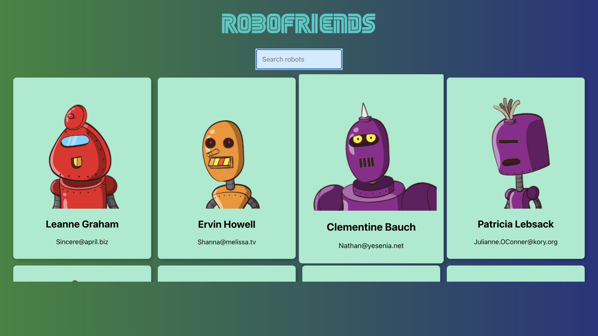

# Robofriends

## Description

A frontend application built with React. Robot cards are dynamically filtered to match search inputs.
 

## Table of Contents  

- [Installation](#installation)  
- [Usage](#usage)
- [License](#license)
- [Contributing](#contributing)
- [Tests](#tests)
- [Credit](#credit)
- [Deployment](#deployment)

## Installation  

N/A

## Usage   

To filter robot cards, type the name of the robot in the search bar. Cards are displayed to match the group of letters in the search box.  

The following images shows the apps functionality:  
App when search box is empty:
  
App when search box is used to filter robot cards

## Contributing  

N/A

## Tests  

N/A

## Credit  

ZTM Academy

## Deployment
[Robofriends](https://wdverse.github.io/robofriends/) 

